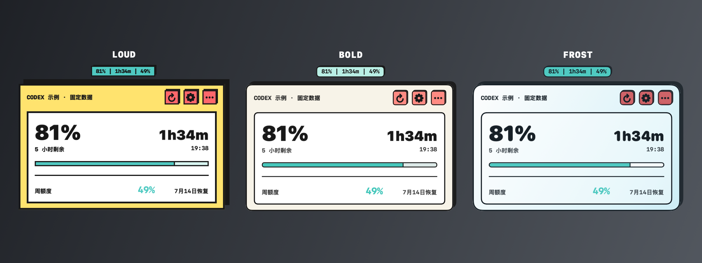
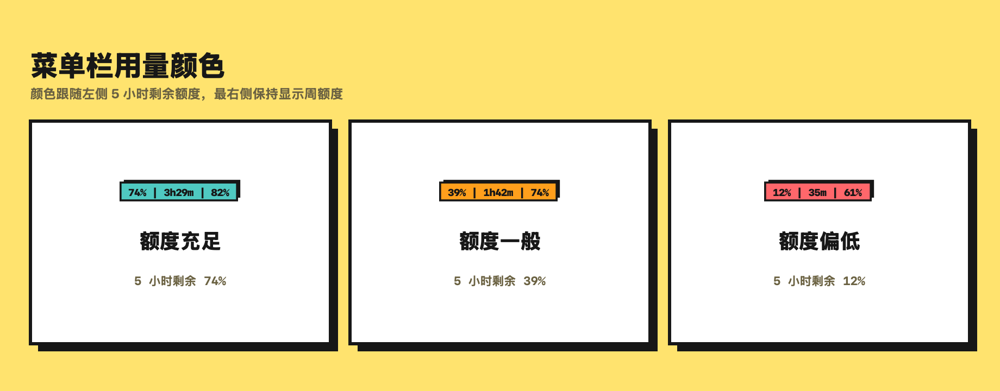
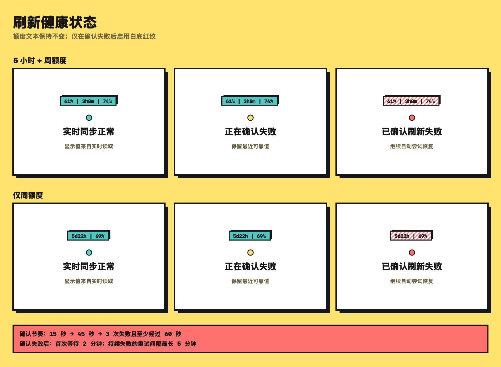
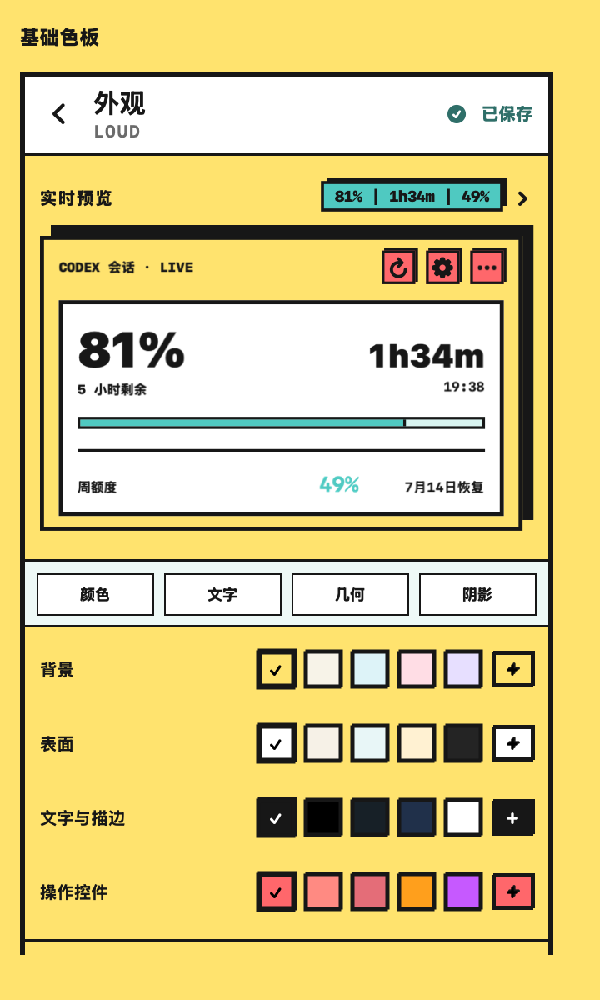
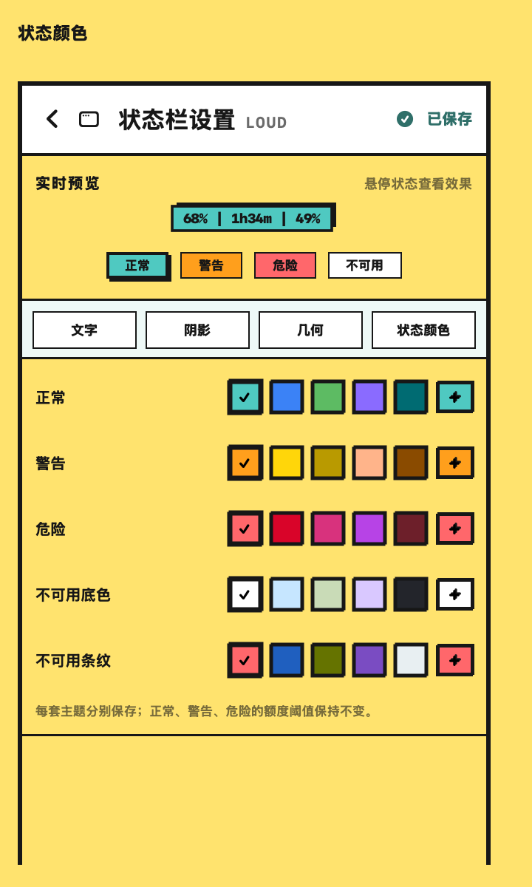
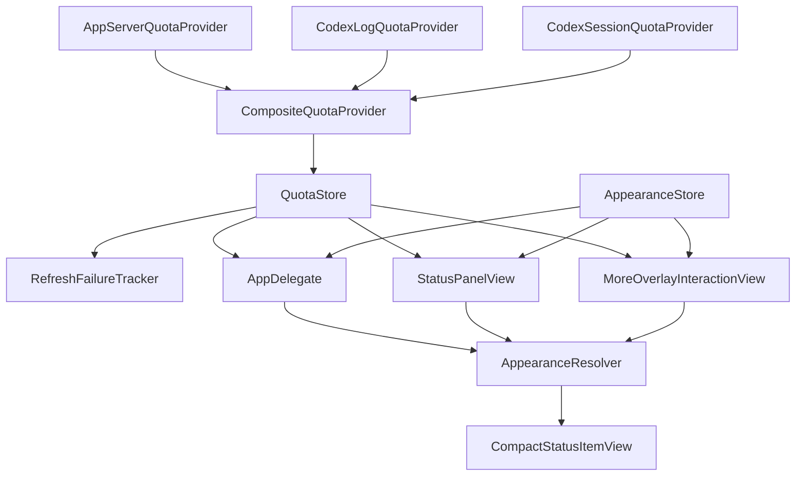

[简体中文](README.md) | **English**

<div align="center">

# Codex Limit Peek

A native, lightweight Codex quota monitor that lives in the macOS menu bar.

[](#system-requirements)
[](Package.swift)
[](LICENSE)

</div>

Codex Limit Peek reads the current active quota windows through the local Codex CLI and compresses quota, reset countdown, and refresh health into the macOS menu bar. It also provides three independently saved appearance themes: LOUD, BOLD, and FROST.

It has no backend of its own and does not make direct quota HTTP requests or handle login credentials. Normal reads stay behind the local `codex app-server` boundary. If the app-server read fails, the app checks sufficiently fresh local Codex records.

## Interface Preview

<p align="center">
  
</p>

Every interface image in this README is generated locally from fixed demonstration data. The three-theme overview uses production theme-preview components, the quota and refresh figures render the production status item, and the two settings figures render the real panel and status-item editors. The renderer adds headings and explanations only outside those production views; all quota values, times, and refresh states are fixed fixtures.

- **LOUD:** High saturation, heavy strokes, and hard shadows create the most direct information hierarchy.
- **BOLD:** Restrained colors, fine strokes, and structured geometry emphasize compactness and order.
- **FROST:** Translucent materials, softer geometry, and accent-color contrast create a lighter macOS feel.

Each theme stores its own colors, panel geometry, and menu bar status-item geometry. Switching themes never overwrites the other two configurations.

## Core Features

### Menu Bar Quota Monitoring

When two quota windows are available, the menu bar shows the remaining 5-hour quota, reset countdown, and weekly quota in that order:

```text
61% | 3h8m | 74%
```

When only one valid quota window is returned, the app switches to a single-window layout showing that window's reset countdown and remaining quota:

```text
5d22h | 69%
```

In the dual-window layout, the countdown belongs to the 5-hour window. In the single-window layout, it belongs to the only valid window. The layout follows the actual quota data and automatically returns to the dual-window form when both windows become available again. The app reads immediately at launch, refreshes every 5 minutes in the background, and also supports manual refresh, wake-from-sleep refresh, and a 10-second request cooldown.

### Quota State Visualization

<p align="center">
  
</p>

The dual-window layout selects normal, warning, or danger from the remaining 5-hour quota. The single-window layout uses the remaining quota of its only valid window. Quota-state logic fixes the thresholds. Each theme can customize the colors used for those states without changing how the state is determined.

<details>
<summary><strong>View the fixed quota thresholds</strong></summary>

| State | Remaining quota |
|---|---:|
| Normal | 46%–100% |
| Warning | 21%–45% |
| Danger | 0%–20% |

</details>

### Refresh Health Monitoring

<p align="center">
  
</p>

Quota level and data freshness are two independent signals:

- **Live:** Shows quota just read from the local Codex CLI.
- **Confirming:** Temporarily keeps the most recent reliable quota and its original solid-color style instead of alarming after a single short-lived error.
- **Confirmed failure:** If a reliable snapshot exists, the app continues to show quota text from the latest reliable value or a fresh local fallback instead of replacing it with an error label. It also enables the current theme's failure pattern. LOUD uses a white background with red diagonal stripes by default.
- **No reliable snapshot:** Uses the real unavailable state and displays `未同步` rather than inventing quota data.

When a reliable snapshot exists, failure indication never replaces quota information. The striped pattern means that live refresh has been confirmed as failed; it does not mean the quota is exhausted.

<details>
<summary><strong>View the failure-confirmation and recovery schedule</strong></summary>

- Wait 15 seconds before retrying after the first failure.
- After the second failure, wait until 60 seconds have elapsed since the first one; in the normal sequence this adds another 45 seconds.
- Confirm refresh failure only after at least 3 consecutive failures and 60 elapsed seconds.
- Wait 2 minutes before the first recovery retry after confirmation.
- During a sustained failure, later retry intervals are capped at 5 minutes.

</details>

### Main Panel Actions

The main panel keeps three compact entry points:

- **Refresh:** Requests an immediate quota update while preserving the 10-second request cooldown.
- **Appearance Settings:** Opens the appearance editor directly from the gear button without first entering More.
- **More:** Opens voice announcements, announcement intervals, and supporting actions such as Quit.

These controls use the active theme's production button styling. Appearance Settings and More are independent pages.

## Appearance System

Appearance editing changes visual presentation only. It does not change quota thresholds, refresh-confirmation logic, or data sources.

### Theme Presets

- **LOUD**, **BOLD**, and **FROST** each retain their own colors, panel settings, status-item settings, and state colors.
- Switching themes never overwrites either of the other profiles.
- The settings page's own font scale is global rather than theme-specific.

### Panel Appearance

<p align="center">
  
</p>

The panel editor keeps a live panel-and-status preview fixed at the top while the controls scroll independently below it. The pinned Color / Text / Geometry / Shadow row jumps directly to each section.

Using LOUD as the example, it can adjust:

- the background, surface, text and outline, and action-control base palette;
- panel font size and the global settings-page font size;
- outline width, corner radius, and panel geometry;
- shadow depth, shadow blur, and surface opacity.

Selecting the status item inside the fixed preview opens its dedicated editor.

### Status Item Appearance

<p align="center">
  
</p>

The status-item editor also keeps its live preview fixed above independently scrolling controls, with pinned Text / Shadow / Geometry / State Colors navigation. Hovering a quota state previews it; clicking pins it.

It independently controls:

- primary and weekly quota text colors;
- shadow color, opacity, horizontal and vertical offsets, and blur;
- font size, outline, corner radius, horizontal padding, and height;
- normal, warning, danger, unavailable-fill, and unavailable-stripe colors.

State colors are part of the status-item editor rather than a separate settings page. Each theme can save different colors without changing the fixed quota thresholds.

<details>
<summary><strong>View every adjustable parameter and range</strong></summary>

| Scope | Adjustable values |
|---|---|
| Theme | LOUD, BOLD, and FROST; saved independently |
| Base palette | Background, surface, text and outline, action controls |
| Panel typography and geometry | Font 80%–125%, outline 0–4 pt, corner radius 0–28 pt |
| Settings typography | Global 90%–150% |
| Panel shadow and surface | Shadow depth 0–10 pt, blur 0–20 pt, surface opacity 55%–100% |
| Status item | Primary text color, weekly text color, shadow color, shadow opacity 0%–100%, horizontal/vertical offsets -10–10 pt, blur 0–8 pt, font 8–14 pt, outline 0–4 pt, corner radius 0–12 pt, horizontal padding 2–14 pt, height 14–22 pt |
| State colors | Normal, warning, danger, unavailable fill, unavailable stripe |
| Reset | Restores only the selected theme; preserves other themes and settings-page font size |

</details>

### Native Color Picker and Theme Reset

Every color setting provides preset swatches and a square “＋” button that opens the native macOS color panel. Base-palette and state colors support opacity; primary text, weekly text, and status-item shadow colors are stored as opaque colors. Continuous changes from the panel, sliders, or eyedropper update the fixed preview immediately and remain attached to the theme selected when the picker opened.

“Restore Current Theme Defaults” resets only the selected theme's colors, panel settings, and status-item settings. It preserves the other themes and the global settings-page font scale. When the theme already matches its defaults, the button is disabled.

## Other Features

- Sends a local notification when quota is low.
- Offers optional voice announcements at 1-, 5-, or 10-minute intervals; their controls remain in More.
- Restores the latest cache at launch before refreshing in the background and can use sufficiently fresh local records when live reading fails.

## Architecture

Quota reading, refresh reliability, and appearance resolution remain separate. Every node below corresponds to a real type in the current source:



`CompositeQuotaProvider` handles live reads and local fallback. `QuotaStore` manages snapshots, refresh scheduling, and failure confirmation. `AppearanceStore` persists theme configurations. Production views obtain their final colors and geometry through `AppearanceResolver`.

## Privacy

Codex Limit Peek stays local-first:

- Does not directly read `auth.json`, Keychain, browser cookies, or other authentication data
- Does not collect or upload prompts, model replies, attachments, or quota history
- Does not log raw app-server responses, SQLite rows, or JSONL session content
- Uses only timestamps and `payload.rate_limits` metadata from JSONL fallback records, without storing or uploading the original lines
- Keeps only the values, timestamps, and layout needed for the latest quota snapshot; it does not build a quota history
- Sends live quota requests only through the local Codex CLI; fallback reads only the local records listed below
- Has no custom backend or telemetry service

## One-Step Installation

Ask Codex to clone this repository and run:

```sh
git clone https://github.com/onlytwokey/Codex-Limit-Peek.git
cd Codex-Limit-Peek
./scripts/install.sh
```

The script performs a SwiftPM Release build in a system-temporary scratch directory, installs the app at `~/Applications/Codex Limit Peek.app`, applies a local signature, and launches it. The temporary SwiftPM cache is removed after either success or failure, and administrator privileges are not required.

This is a local source-build workflow and therefore does not depend on a Developer ID. A future directly downloadable prebuilt app would still require formal signing and Apple notarization.

## Data Sources and Fallback

Under normal conditions, Codex Limit Peek starts a short-lived local process:

```text
codex app-server --stdio
```

The app reads aggregate `codex` quota through `account/rateLimits/read` and ignores model-specific limits. The Codex CLI completes the request with its existing login state; Codex Limit Peek itself neither reads nor outputs credentials.

If the app-server is unavailable, the app checks these local sources:

```text
~/.codex/logs_2.sqlite
~/.codex/sessions
~/.codex/archived_sessions
```

Local fallback accepts only records from the previous 15 minutes. The SQLite path reads Codex quota response headers, while the JSONL path accepts only aggregate records where `limit_id == "codex"`. JSONL fallback checks at most the 20 most recent candidate files and reads only the final 256 KB of each. Records beyond the freshness threshold are never relabeled as newly synchronized.

At launch, the app restores the last cached snapshot before refreshing in the background. If live refresh is confirmed as failed while a reliable snapshot remains available, the menu bar keeps the most recent usable value and applies the current theme's failure pattern. When a reset time has already passed, the countdown displays `—`.

## Development and Project Structure

Common commands:

```sh
./scripts/test.sh
./scripts/build-app.sh
./scripts/restart.sh
./scripts/test-install.sh
```

Switch to a Debug build with the same app identity and inspect the real panel
with deterministic data in a standard developer window:

```sh
./scripts/run-developer-preview.sh
```

The script completes the Debug build, identifies the exact running production
process, and stops it only after validation. Testing starts only after a window
readiness handshake. Closing Developer Preview restores the untouched installed
app to its original running state. The window controls theme, quota scenarios,
and Current/Candidate; its fixtures use in-memory preferences and never write
production settings. Release builds contain no developer entry or internal
wiring.

Regenerate and validate the README images:

```sh
./scripts/render-doc-previews.sh
./scripts/validate-doc-images.sh
```

Image generation runs only in the local contributor workflow. GitHub Actions does not start the SwiftUI/AppKit documentation renderer. CI continues to validate the committed PNG dimensions, DPI, sRGB profile, file sizes, and README references.

Development builds keep the incremental `.build` cache. The end-user installation workflow always places SwiftPM build artifacts in a system-temporary scratch directory and removes that directory when it exits.

```text
.
├── Package.swift
├── README.md
├── README.en.md
├── LICENSE
├── NOTICE.md
├── scripts/
│   ├── build-app.sh
│   ├── install.sh
│   ├── render-doc-previews.sh
│   ├── restart.sh
│   ├── test-install.sh
│   ├── test.sh
│   └── validate-doc-images.sh
├── Sources/
│   └── CodexLimitPeek/
│       ├── App/
│       │   ├── AppDelegate.swift
│       │   └── CodexLimitPeekApp.swift
│       ├── Appearance/
│       │   ├── AppearanceStore.swift
│       │   ├── ThemeChromeViews.swift
│       │   └── Editor/
│       │       ├── AppearanceEditorView.swift
│       │       ├── StatusItemEditorView.swift
│       │       └── …
│       ├── DeveloperTools/
│       ├── MenuBar/
│       │   ├── CompactStatusItemView.swift
│       │   └── …
│       └── Quota/
│           ├── QuotaStore.swift
│           └── …
└── Tests/
    └── CodexLimitPeekTests/
        ├── Appearance/
        ├── Application/
        ├── DeveloperTools/
        ├── Documentation/
        └── Quota/
```

## System Requirements

- macOS 14 or later
- Swift 6 toolchain
- Codex CLI installed and signed in; the Codex CLI bundled with ChatGPT.app is also supported

## FAQ

**The menu bar item does not appear. What should I do?**

Run `./scripts/restart.sh` first. macOS may also hide the item when the menu bar is crowded.

**The quota looks inaccurate. What should I do?**

Click the refresh button first. A normal state comes from the local Codex CLI; the failure pattern means that live refresh has been confirmed as failed. If a reliable value already exists, the numbers remain the latest usable quota and the panel shows their source and update time. If no reliable value has ever been available, the app displays `未同步`.

**Why is there no prebuilt app?**

The current workflow builds locally from source, and Codex can complete the installation without interaction. A directly downloadable app would require Developer ID signing and Apple notarization, which are planned for a later release stage.

## License, Attribution, and Disclaimer

This project uses the [MIT License](LICENSE).

Codex Limit Peek is based on and continues development from the upstream
[HappyChenchen/codex-meter](https://github.com/HappyChenchen/codex-meter)
project. The upstream project provided the foundations for macOS menu bar quota display, local record reading, optional voice announcements, and notifications. See [NOTICE.md](NOTICE.md) for the complete attribution and license notice.

This project grows through iterative, real-world use and vibe coding. Its goal is to make Codex quota lightweight, glanceable, and suitable for long-term menu bar use rather than expanding a small utility into a framework.

Codex Limit Peek is not an official OpenAI project. The app-server remains an experimental interface. If the protocol changes or local login state becomes unavailable, the app safely falls back to local records or its cache.
