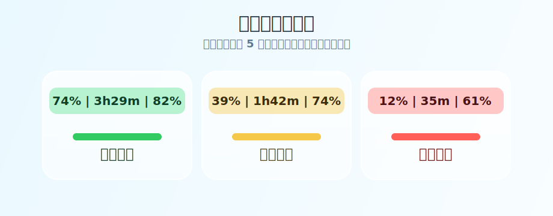

<div align="center">

# Codex Limit Peek

一个放在 macOS 菜单栏里的 Codex 额度小表。

[](#系统要求)
[](Package.swift)
[](LICENSE)

</div>

Codex Limit Peek 会通过本机 Codex CLI 获取当前有效的额度窗口，并把最关键的信息放在菜单栏里。双窗口可用时显示 5 小时额度、恢复倒计时和周额度：

```text
61% | 3h08m | 74%
```

它没有自己的后端，也不直接处理登录凭据。应用会调用本机 `codex app-server`，由 Codex CLI 使用已有登录状态获取额度；短时故障时才回退到本地日志。

本项目纯 vibe coding：从真实使用场景出发，把 Codex 额度做成一个轻量、直观、常驻的菜单栏状态。

## 界面预览


双窗口可用时，菜单栏状态会跟随 5 小时剩余额度变色：



## 它能做什么

- 自动适配 5 小时加周额度，或仅周额度的服务端配置
- 在菜单栏显示当前额度、恢复倒计时和周额度
- 启动和手动刷新时获取当前额度
- 后台每 5 分钟自动刷新
- 额度较低时发本地通知
- 可选语音播报，支持 1 / 5 / 10 分钟间隔
- 刷新失败时保留上次值，并显示白底红色斜纹
- 不读取认证文件，不上传提示词、回复或附件

## 一键安装

让 Codex 克隆本仓库并执行：

```sh
git clone https://github.com/onlytwokey/Codex-Limit-Peek.git
cd Codex-Limit-Peek
./scripts/install.sh
```

脚本会在系统临时目录完成 Release 构建，把应用安装到
`~/Applications/Codex Limit Peek.app`，进行本地签名并启动。构建成功或失败后，
临时 SwiftPM 缓存都会自动清理，不需要管理员权限。

这是源码本机构建流程，因此不依赖 Developer ID。未来如果提供可直接下载的
预编译 App，仍需要正式签名和 Apple 公证。

## 开发运行

```sh
./scripts/test.sh
./scripts/build-app.sh
./scripts/restart.sh
```

开发构建会保留 `.build` 增量缓存，以缩短后续编译时间。安装流程验证可运行
`./scripts/test-install.sh`。

## 数据从哪里来

正常情况下，Codex Limit Peek 启动一个短生命周期的本机进程：

```text
codex app-server --stdio
```

应用通过 `account/rateLimits/read` 读取 `codex` 聚合额度。服务端只返回周窗口时，界面会自动切换为周额度倒计时；后续恢复双窗口时会自动恢复原布局。Codex CLI 使用已有登录状态完成请求；Codex Limit Peek 本身不读取或输出凭据。

app-server 不可用时，应用会读取以下本地来源作为回退：

```text
~/.codex/logs_2.sqlite
~/.codex/sessions
~/.codex/archived_sessions
```

本地回退只接受 15 分钟内的 `codex` 聚合记录，并忽略模型专属额度。超过新鲜度阈值的记录不会被重新标记成刚刚同步。

应用启动时会立即恢复上次缓存，再在后台刷新。若实时刷新失败，菜单栏保留最近一次可用值并切换为白底红色斜纹；恢复时间已经过去时，倒计时显示 `—`。

## 项目结构

```text
.
├── Package.swift
├── README.md
├── LICENSE
├── NOTICE.md
├── scripts/
│   ├── build-app.sh
│   ├── install.sh
│   ├── restart.sh
│   ├── test-install.sh
│   └── test.sh
├── Tests/
│   └── CodexLimitPeekTests/
│       ├── AppDelegateLifecycleTests.swift
│       ├── AppServerQuotaProviderTests.swift
│       ├── CodexSessionQuotaProviderTests.swift
│       ├── QuotaStoreTests.swift
│       └── RefreshReliabilityTests.swift
└── Sources/
    └── CodexLimitPeek/
        ├── AppServerQuotaProvider.swift
        ├── CodexLimitPeekApp.swift
        └── RefreshReliability.swift
```

代码目前故意保持得很小，没有拆成很多层。这个项目的目标是把事情做好，而不是把一个菜单栏小工具写成框架。

## 系统要求

- macOS 14 或更新版本
- Swift 6 工具链
- 已安装并登录 Codex CLI；ChatGPT.app 内置的 Codex CLI 也受支持

## 常见问题

**菜单栏没有出现？**

先运行 `./scripts/restart.sh`。如果菜单栏空间太挤，macOS 也可能把它藏起来。

**额度看起来不准？**

先点击刷新按钮。正常状态来自本机 Codex CLI；白底红色斜纹表示实时刷新失败，此时数字是最近一次可用值，面板会显示来源和更新时间。

**为什么不提供预编译 App？**

当前使用源码本地构建，Codex 可以无交互完成安装。直接下载的 App 需要 Developer ID
签名和 Apple 公证，计划在后续发布阶段处理。

## 隐私

Codex Limit Peek 不直接读取 `auth.json`、Keychain、浏览器 Cookie 或其他认证信息，也不会收集或上传提示词、回复、附件。它会启动本机 Codex CLI，由 CLI 使用已有登录状态获取额度；应用不会记录原始 app-server 响应或本地日志行。

## 许可证

[MIT](LICENSE)

上游项目和初始提交归属见 [NOTICE.md](NOTICE.md)。

## 说明

这个项目不是 OpenAI 官方项目。app-server 仍是实验性接口；协议变化或本机登录状态异常时，应用会安全降级到本地记录或缓存。
