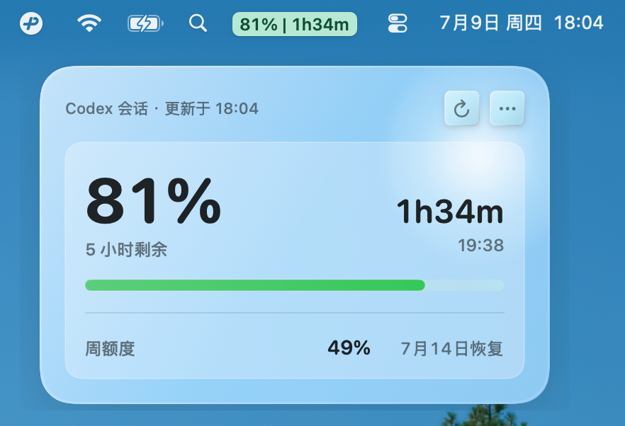
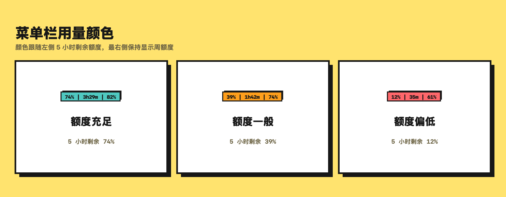
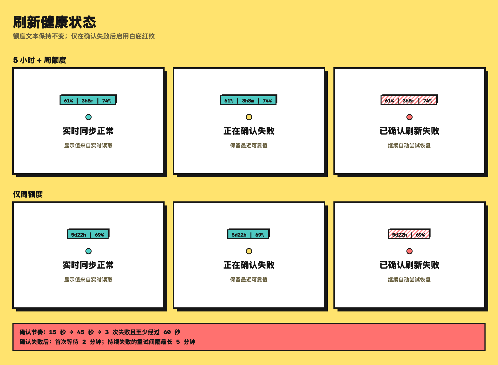
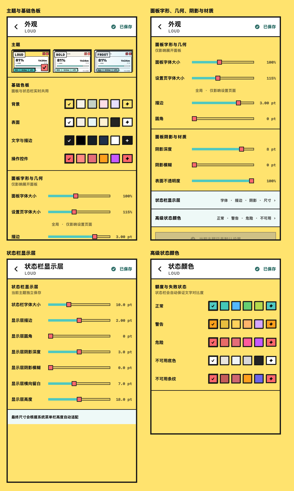
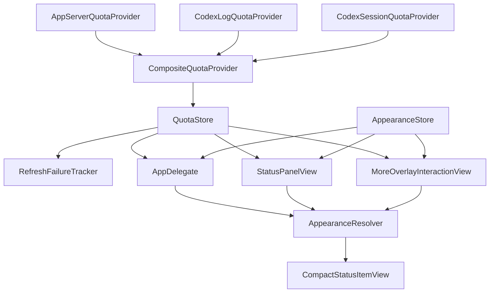

<div align="center">

# Codex Limit Peek

一个原生、轻量、常驻菜单栏的 Codex 额度监控器。

[](#系统要求)
[](Package.swift)
[](LICENSE)

</div>

Codex Limit Peek 通过本机 Codex CLI 读取当前有效的额度窗口，把额度、恢复倒计时和刷新健康状态压缩到 macOS 菜单栏中；同时提供 LOUD、BOLD、FROST 三套可逐主题保存的外观。

它没有自己的后端，也不直接发起额度 HTTP 请求或处理登录凭据。正常读取发生在本机 `codex app-server` 边界内；app-server 读取失败时，应用会查询足够新鲜的本地 Codex 记录。

## 界面预览

<p align="center">
  
</p>

README 中的界面图都由仓库内的文档渲染器使用固定演示数据生成：额度与刷新图直接渲染生产 `CompactStatusItemView`，设置图使用真实编辑器页面，三主题总览使用源码中的主题预览组件与同一套外观解析。渲染器只在这些视图外添加说明；图中的额度、倒计时和刷新状态不是用户真实数据。

- **LOUD：** 高饱和、粗描边与硬阴影，信息层级最直接。
- **BOLD：** 克制配色、细描边与结构化几何，强调紧凑和秩序。
- **FROST：** 半透明材质、柔和几何与强调色对比，更接近轻盈的 macOS 质感。

三套主题分别保存颜色、面板几何和状态栏显示层几何；切换主题不会覆盖另外两套配置。

## 核心功能

### 菜单栏额度监控

双窗口可用时，菜单栏依次显示 5 小时剩余额度、恢复倒计时和周额度：

```text
61% | 3h8m | 74%
```

只返回一个有效额度窗口时，应用会切换为单窗口布局，显示该窗口的恢复倒计时和剩余额度：

```text
5d22h | 69%
```

双窗口布局中的倒计时对应 5 小时窗口，单窗口布局中的倒计时对应唯一有效窗口。窗口数量由实际额度数据决定；后续再次返回双窗口后，菜单栏也会自动恢复原布局。应用启动时立即读取，后台每 5 分钟刷新，也支持手动刷新、睡眠唤醒后刷新和 10 秒请求冷却。

### 额度状态可视化

<p align="center">
  
</p>

双窗口布局会根据 5 小时剩余额度自动切换正常、警告和危险状态；单窗口布局则使用唯一有效窗口的剩余额度。状态阈值由额度状态逻辑固定；每个主题可以自定义这些状态使用的颜色，但不会改变状态判定。

<details>
<summary><strong>查看固定额度阈值</strong></summary>

| 状态 | 剩余额度 |
|---|---:|
| 正常 | 46%–100% |
| 警告 | 21%–45% |
| 危险 | 0%–20% |

</details>

### 刷新健康监控

<p align="center">
  
</p>

额度高低和数据是否新鲜是两套独立语义：

- **实时成功：** 显示刚刚从本机 Codex CLI 读取的额度。
- **正在确认：** 暂时保留最近一次可靠额度和原有纯色样式，不因一次短时错误立即报警。
- **确认失败：** 有可靠快照时继续显示额度文本（最近可靠值或新鲜本地回退值），不会换成错误文案；同时启用当前主题的失败纹理。LOUD 默认是白底红色斜纹。
- **没有可靠快照：** 使用真实的不可用状态并显示 `未同步`，不会虚造额度。

因此，在已有可靠快照的前提下，失败提示不会替换额度信息；斜纹表达的是“实时刷新已确认失败”，不是“额度已经耗尽”。

<details>
<summary><strong>查看失败确认与恢复节奏</strong></summary>

- 第一次失败后等待 15 秒重试。
- 第二次等待到距首次失败满 60 秒；正常流程中通常是再等待 45 秒。
- 至少连续失败 3 次且已经过 60 秒，才确认刷新失败。
- 首次确认失败后等待 2 分钟恢复重试。
- 持续失败时，后续重试间隔上限为 5 分钟。

</details>

### 功能一览

- 自动适配双窗口和单窗口额度布局
- 启动、手动、定时及睡眠唤醒后刷新
- 短时故障确认、最近可靠值保留和自动恢复重试
- app-server 不可用时使用有新鲜度上限的本地回退
- 额度较低时发送本地通知
- 可选语音播报，支持 1 / 5 / 10 分钟间隔
- LOUD、BOLD、FROST 三套逐主题外观
- 独立的面板、状态栏显示层与状态颜色设置
- macOS 原生取色面板、透明度和连续预览
- 无遥测，不上传提示词、回复、附件或额度记录

## 外观系统

外观编辑只改变视觉表达，不改变额度阈值、刷新确认逻辑或数据来源。

### 主题预设

- **LOUD**、**BOLD**、**FROST** 都拥有独立的颜色配置。
- 面板字体、描边、圆角、阴影和表面不透明度按主题保存。
- 状态栏字体、描边、圆角、阴影、留白和高度也按主题独立保存。
- 设置页自身的字体比例是全局选项，不随主题切换。

### 外观编辑器

<p align="center">
  
</p>

以 LOUD 为例，完整外观编辑器分为四组：

- **面板：** 基础色板、面板字体与几何、阴影和表面不透明度。
- **状态栏显示层：** 独立的字体、描边、圆角、阴影、横向留白和高度。
- **状态颜色：** 正常、警告、危险、不可用底色和不可用条纹。
- **设置页字形：** 单独调节编辑器自身的全局字体比例。

<details>
<summary><strong>查看全部可调参数与范围</strong></summary>

| 范围 | 可调内容 |
|---|---|
| 主题 | LOUD、BOLD、FROST；分别保存 |
| 基础色板 | 背景、表面、文字与描边、操作控件 |
| 面板字形与几何 | 字体 80%–125%、描边 0–4 pt、圆角 0–28 pt |
| 设置页字形 | 全局 90%–150% |
| 面板阴影与表面 | 阴影深度 0–10 pt、模糊 0–20 pt、表面不透明度 55%–100% |
| 状态栏显示层 | 字体 8–14 pt、描边 0–4 pt、圆角 0–12 pt、阴影深度 0–6 pt、模糊 0–8 pt、横向留白 2–14 pt、高度 14–22 pt |
| 状态颜色 | 正常、警告、危险、不可用底色、不可用条纹 |
| 重置 | 只恢复当前选中主题 |

</details>

### 原生取色

每个颜色项都提供预设色块，也可以通过方形“＋”按钮打开 macOS 原生取色面板。系统面板支持透明度和连续颜色更新，调整结果会实时进入当前预览，并保存到打开取色器时选中的主题。

## 架构

额度读取、刷新可靠性和外观解析保持分离。下面的节点都对应当前源码中的真实类型：



`CompositeQuotaProvider` 负责实时读取和本地回退；`QuotaStore` 管理快照、刷新调度与失败确认；`AppearanceStore` 保存主题配置；各真实视图通过 `AppearanceResolver` 得到最终颜色和几何。

## 隐私

Codex Limit Peek 保持本地优先：

- 不直接读取 `auth.json`、Keychain、浏览器 Cookie 或其他认证信息
- 不收集或上传提示词、模型回复、附件或额度历史
- 不记录原始 app-server 响应、SQLite 行或 JSONL 会话内容
- JSONL 回退只使用时间戳和 `payload.rate_limits` 元数据，不保存或上传原始行
- 本地缓存只保留最近一份额度快照所需的数值、时间和布局，不形成额度历史
- 实时联网额度请求只通过本机 Codex CLI；回退只读取下列本地记录
- 没有自建后端或遥测服务

## 一键安装

让 Codex 克隆本仓库并执行：

```sh
git clone https://github.com/onlytwokey/Codex-Limit-Peek.git
cd Codex-Limit-Peek
./scripts/install.sh
```

脚本会在系统临时 scratch 目录完成 SwiftPM Release 编译，把应用安装到
`~/Applications/Codex Limit Peek.app`，进行本地签名并启动。构建成功或失败后，临时 SwiftPM 缓存都会自动清理，不需要管理员权限。

这是源码本机构建流程，因此不依赖 Developer ID。未来如果提供可直接下载的预编译 App，仍需要正式签名和 Apple 公证。

## 数据来源与回退

正常情况下，Codex Limit Peek 启动一个短生命周期的本机进程：

```text
codex app-server --stdio
```

应用通过 `account/rateLimits/read` 读取 `codex` 聚合额度，并忽略模型专属额度。Codex CLI 使用已有登录状态完成请求；Codex Limit Peek 本身不读取或输出凭据。

app-server 不可用时，应用会检查以下本地来源：

```text
~/.codex/logs_2.sqlite
~/.codex/sessions
~/.codex/archived_sessions
```

本地回退只接受 15 分钟内的记录：SQLite 路径读取 Codex 额度响应头，JSONL 路径只接受 `limit_id == "codex"` 的聚合记录。JSONL 回退最多检查最近 20 个候选文件，每个文件只读取尾部 256 KB；超过新鲜度阈值的记录不会被重新标记成刚刚同步。

应用启动时会先恢复上次缓存，再在后台刷新。若实时刷新确认失败且仍有可靠快照，菜单栏保留最近一次可用值并使用当前主题的失败纹理；恢复时间已经过去时，倒计时显示 `—`。

## 开发与项目结构

常用命令：

```sh
./scripts/test.sh
./scripts/build-app.sh
./scripts/restart.sh
./scripts/test-install.sh
```

重新生成并校验 README 图片：

```sh
./scripts/render-doc-previews.sh
./scripts/validate-doc-images.sh
```

图片生成只在本地贡献流程中运行；GitHub Actions 不启动 SwiftUI/AppKit
文档渲染器。CI 会继续检查已提交 PNG 的尺寸、DPI、sRGB、文件大小和
README 引用。

开发构建会保留 `.build` 增量缓存；面向最终用户的安装流程始终把 SwiftPM 编译缓存放在系统临时 scratch 目录并在结束时清理。

```text
.
├── Package.swift
├── README.md
├── LICENSE
├── NOTICE.md
├── scripts/
│   ├── build-app.sh
│   ├── install.sh
│   ├── render-doc-previews.sh
│   ├── restart.sh
│   ├── test-install.sh
│   ├── test.sh
│   └── validate-doc-images.sh
├── Sources/
│   └── CodexLimitPeek/
│       ├── App/
│       │   ├── AppDelegate.swift
│       │   └── CodexLimitPeekApp.swift
│       ├── Quota/
│       │   ├── QuotaStore.swift
│       │   └── …
│       ├── MenuBar/
│       │   ├── CompactStatusItemView.swift
│       │   └── …
│       └── Appearance/
│           ├── AppearanceStore.swift
│           ├── ThemeChromeViews.swift
│           └── Editor/
│               ├── AppearanceEditorView.swift
│               └── …
└── Tests/
    └── CodexLimitPeekTests/
        ├── Application/
        ├── Quota/
        ├── Appearance/
        └── Documentation/
```

## 系统要求

- macOS 14 或更新版本
- Swift 6 工具链
- 已安装并登录 Codex CLI；ChatGPT.app 内置的 Codex CLI 也受支持

## 常见问题

**菜单栏没有出现？**

先运行 `./scripts/restart.sh`。如果菜单栏空间太挤，macOS 也可能把它藏起来。

**额度看起来不准？**

先点击刷新按钮。正常状态来自本机 Codex CLI；失败纹理表示实时刷新已经确认失败。若此前有可靠值，数字仍是最近一次可用额度，面板会显示来源和更新时间；若从未取得可靠值，则显示 `未同步`。

**为什么不提供预编译 App？**

当前使用源码本地构建，Codex 可以无交互完成安装。直接下载的 App 需要 Developer ID 签名和 Apple 公证，计划在后续发布阶段处理。

## 许可证、归属与说明

本项目使用 [MIT License](LICENSE)。

Codex Limit Peek 基于上游项目
[HappyChenchen/codex-meter](https://github.com/HappyChenchen/codex-meter)
修改并继续开发。上游项目提供了 macOS 菜单栏额度展示、本地记录读取、可选语音播报和通知等基础能力；更完整的提交归属与许可证说明见 [NOTICE.md](NOTICE.md)。

这个项目从真实使用场景出发，以 vibe coding 方式持续迭代。目标是把 Codex 额度做成一个轻量、直观、适合长期常驻的菜单栏状态，而不是把小工具扩张成框架。

Codex Limit Peek 不是 OpenAI 官方项目。app-server 仍是实验性接口；协议变化或本机登录状态异常时，应用会安全降级到本地记录或缓存。
