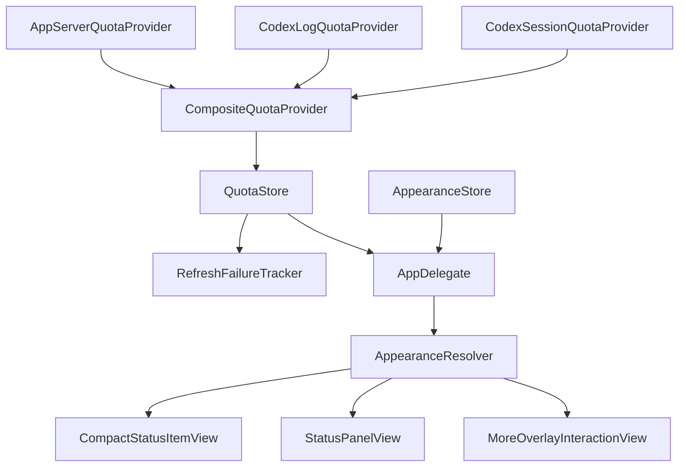

# LOUD README Visual Refresh Implementation Plan

> **For agentic workers:** REQUIRED SUB-SKILL: Use superpowers:subagent-driven-development (recommended) or superpowers:executing-plans to implement this plan task-by-task. Steps use checkbox (`- [ ]`) syntax for tracking.

**Goal:** Replace the remaining legacy README diagrams with deterministic LOUD renders of production UI, expand the appearance screenshot into a complete 2×2 atlas, and reorganize README content around product behavior before appearance customization.

**Architecture:** Keep runtime behavior unchanged and add read-only documentation seams for reference-date quota formatting, a fixed status-bar thickness accepted by `CompactStatusItemView.update`, and initial scroll targets for existing long editor sections. The test-only renderer composes external LOUD documentation cards around the real `CompactStatusItemView` and existing overlay pages, writes all four PNG assets in one batch, and relies on the transactional shell installer to replace the repository asset set atomically.

**Tech Stack:** Swift 6, SwiftUI, AppKit, Swift Testing, ImageIO, Bash, `sips`, GitHub Actions.

---

## File map

- Modify `Sources/CodexLimitPeek/CodexLimitPeekApp.swift`
  - Let documentation rendering format quota text against a fixed reference date and inject a fixed status-bar thickness while preserving current runtime defaults.
- Modify `Sources/CodexLimitPeek/AppearanceEditorView.swift`
  - Add documentation-only `.panelControls` and `.stateColorControls` scroll anchors and keep all ordinary editor behavior unchanged.
- Modify `Tests/CodexLimitPeekTests/DocumentationPreviewSeamTests.swift`
  - Lock down the documentation seams and their default-off behavior.
- Modify `Tests/CodexLimitPeekTests/DocumentationPreviewRenderer.swift`
  - Define fixed synthetic snapshots, render production menu-bar status items, build both LOUD state matrices, and render the four-cell appearance atlas.
- Modify `Tests/CodexLimitPeekTests/DocumentationPreviewRendererTests.swift`
  - Test exact fixture text, production rendering behavior, failure semantics, dimensions, metadata, isolation, and repeatability.
- Modify `scripts/render-doc-previews.sh`
  - Transactionally stage, back up, replace, compare, and roll back all four README PNGs.
- Modify `scripts/validate-doc-images.sh`
  - Validate the four-file asset contract, new README references, size budgets, and removal of legacy SVG references.
- Modify `README.md`
  - Apply the approved product-first information architecture and source-backed appearance inventory.
- Replace `docs/images/appearance-settings-loud.png`
  - Install the 1440×2400 four-cell atlas.
- Create `docs/images/quota-states-loud.png`
  - Install the 1840×720 production status-item quota matrix.
- Create `docs/images/refresh-states-loud.png`
  - Install the 1840×1350 production refresh-health matrix.
- Delete `docs/images/quota-states.svg`
- Delete `docs/images/refresh-states.svg`

### Task 1: Add deterministic production-view seams

**Files:**
- Modify: `Sources/CodexLimitPeek/CodexLimitPeekApp.swift`
- Modify: `Sources/CodexLimitPeek/AppearanceEditorView.swift`
- Test: `Tests/CodexLimitPeekTests/DocumentationPreviewSeamTests.swift`
- Test: `Tests/CodexLimitPeekTests/StatusItemAppearanceTests.swift`
- Test: `Tests/CodexLimitPeekTests/QuotaStoreTests.swift`

- [ ] **Step 1: Write failing seam tests**

Add assertions that the environment target defaults to `nil`, accepts
`.panelControls`, and that both long control-page targets receive extra
trailing space while `.themeSelector` does not:

```swift
@Test
func documentationOverridesAreDefaultOff() {
    var environment = EnvironmentValues()

    #expect(environment.themeStatusBarThicknessOverride == nil)
    #expect(environment.appearanceEditorInitialScrollTarget == nil)

    environment.themeStatusBarThicknessOverride = 22
    environment.appearanceEditorInitialScrollTarget = .panelControls

    #expect(environment.themeStatusBarThicknessOverride == 22)
    #expect(
        environment.appearanceEditorInitialScrollTarget
            == .panelControls
    )
}
```

Add a status-item test that calls `update` with `statusBarThickness: 22` and
expects `view.frame.height == 22`.

Add a snapshot-formatting test:

```swift
let referenceDate = Date(timeIntervalSince1970: 1_725_450_400)
var snapshot = makeSnapshot()
snapshot.remainingPercent = 74
snapshot.resetDate = referenceDate.addingTimeInterval(
    3 * 3_600 + 29 * 60
)

#expect(
    snapshot.menuBarTitle(relativeTo: referenceDate)
        == "74% | 3h29m"
)
```

- [ ] **Step 2: Run the focused tests and verify failure**

Run:

```sh
scripts/test.sh --filter DocumentationPreviewSeamTests
scripts/test.sh --filter StatusItemAppearanceTests
scripts/test.sh --filter QuotaStoreTests
```

Expected: compilation fails because `.panelControls` and
`statusBarThickness:` and the reference-date formatter do not yet exist.

- [ ] **Step 3: Add deterministic snapshot formatting**

Keep the existing properties as runtime entry points, then add pure overloads
used by the renderer:

```swift
var menuBarTitle: String {
    menuBarTitle(relativeTo: Date())
}

func menuBarTitle(relativeTo referenceDate: Date) -> String {
    guard !isUnavailable else { return "未同步" }
    switch displayMode {
    case .dualWindow:
        return "\(percentText) | \(shortResetText(relativeTo: referenceDate))"
    case .weeklyOnly:
        return shortResetText(relativeTo: referenceDate)
    }
}

var shortResetText: String {
    shortResetText(relativeTo: Date())
}

func shortResetText(relativeTo referenceDate: Date) -> String {
    guard !isUnavailable else { return "—" }
    return compactResetText(
        for: resetDate,
        relativeTo: referenceDate
    )
}

private func compactResetText(
    for date: Date,
    relativeTo referenceDate: Date
) -> String {
    guard date > referenceDate else { return "—" }
    let seconds = max(
        Int(date.timeIntervalSince(referenceDate)),
        0
    )
    let days = seconds / 86_400
    let hours = (seconds % 86_400) / 3_600
    let minutes = (seconds % 3_600) / 60
    if days > 0 {
        return "\(days)d\(hours)h"
    }
    if hours > 0 {
        return "\(hours)h\(minutes)m"
    }
    return "\(minutes)m"
}
```

- [ ] **Step 4: Add the minimal fixed-thickness seam**

Change the production method signature without changing existing callers:

```swift
func update(
    title: String,
    weeklyTitle: String?,
    appearance: ResolvedStatusItemAppearance,
    showsFailurePattern: Bool,
    tooltip: String,
    statusBarThickness: CGFloat = NSStatusBar.system.thickness
) {
    self.title = title
    self.weeklyTitle = weeklyTitle
    resolvedAppearance = appearance
    self.showsFailurePattern = showsFailurePattern
    self.toolTip = tooltip
    setAccessibilityElement(true)
    setAccessibilityRole(.button)
    setAccessibilityLabel("Codex Limit Peek")
    setAccessibilityValue(
        [title, weeklyTitle]
            .compactMap { $0 }
            .filter { !$0.isEmpty }
            .joined(separator: " | ")
    )
    setAccessibilityHelp(tooltip)

    let chromeWidth = CGFloat(
        appearance.outlineWidth * 2
            + appearance.shadowDepth
            + appearance.shadowBlur * 2
    )
    let width = ceil(
        attributedTitle.size().width
            + horizontalPadding * 2
            + chromeWidth
    )
    frame = NSRect(
        x: 0,
        y: 0,
        width: width,
        height: statusBarThickness
    )
    needsDisplay = true
}
```

- [ ] **Step 5: Add the panel-controls scroll target**

Extend the enum:

```swift
enum AppearanceEditorInitialScrollTarget: Hashable, Sendable {
    case themeSelector
    case panelControls
    case statusItemControls
    case stateColorControls
}
```

Attach `.id(.panelControls)` to `geometrySection`, and update the appearance
editor task to scroll to either supported appearance-page target:

```swift
.task(id: initialScrollTarget) {
    guard
        initialScrollTarget == .themeSelector
            || initialScrollTarget == .panelControls
    else {
        return
    }
    await Task.yield()
    proxy.scrollTo(initialScrollTarget, anchor: .top)
}
```

Return one page height for `.panelControls`, `.statusItemControls`, and
`.stateColorControls`, and zero for `nil` or `.themeSelector`. Inject the clear
trailing spacer only when a documentation target needs it, so each long control
section can align with the top without changing normal application content.

- [ ] **Step 6: Run focused tests and verify success**

Run:

```sh
scripts/test.sh --filter DocumentationPreviewSeamTests
scripts/test.sh --filter StatusItemAppearanceTests
scripts/test.sh --filter QuotaStoreTests
```

Expected: all three suites pass.

- [ ] **Step 7: Commit the seam**

```sh
git add \
  Sources/CodexLimitPeek/CodexLimitPeekApp.swift \
  Sources/CodexLimitPeek/AppearanceEditorView.swift \
  Tests/CodexLimitPeekTests/DocumentationPreviewSeamTests.swift \
  Tests/CodexLimitPeekTests/StatusItemAppearanceTests.swift \
  Tests/CodexLimitPeekTests/QuotaStoreTests.swift
git commit -m "test: add deterministic documentation seams"
```

### Task 2: Define and test the complete renderer contract

**Files:**
- Modify: `Tests/CodexLimitPeekTests/DocumentationPreviewRendererTests.swift`
- Modify: `Tests/CodexLimitPeekTests/DocumentationPreviewRenderer.swift`

- [ ] **Step 1: Write failing fixture and production-status tests**

Define tests for the approved fixture collection:

```swift
#expect(
    DocumentationPreviewRenderer.quotaFixtures
        .map(\.displayText)
        == [
            "74% | 3h29m | 82%",
            "39% | 1h42m | 74%",
            "12% | 35m | 61%"
        ]
)
#expect(
    DocumentationPreviewRenderer.refreshFixtures
        .map(\.displayText)
        == [
            "61% | 3h8m | 74%",
            "61% | 3h8m | 74%",
            "61% | 3h8m | 74%",
            "5d22h | 69%",
            "5d22h | 69%",
            "5d22h | 69%"
        ]
)
```

Add async tests using the standalone production-view rasterizer:

```swift
let live = try await DocumentationPreviewRenderer
    .renderStatusItemForTesting(
        snapshot: fixture.snapshot,
        health: .live,
        referenceDate: fixture.referenceDate
    )
let confirming = try await DocumentationPreviewRenderer
    .renderStatusItemForTesting(
        snapshot: fixture.snapshot,
        health: .confirmingFailure,
        referenceDate: fixture.referenceDate
    )
let confirmed = try await DocumentationPreviewRenderer
    .renderStatusItemForTesting(
        snapshot: fixture.snapshot,
        health: .degraded,
        referenceDate: fixture.referenceDate
    )

#expect(live == confirming)
#expect(live != confirmed)
```

Also assert that the configured live, confirming, and confirmed
`CompactStatusItemView` objects expose the same accessibility value, proving
that failure styling does not replace quota text.

- [ ] **Step 2: Write failing complete-asset tests**

Update `rendersApprovedAssets` to require:

```swift
let approved: [String: (Int, Int)] = [
    "panel-preview.png": (2_400, 900),
    "quota-states-loud.png": (1_840, 720),
    "refresh-states-loud.png": (1_840, 1_350),
    "appearance-settings-loud.png": (1_440, 2_400)
]
```

Retain the PNG, sRGB, 144±0.5 DPI, ≤3 MiB per-file, ≤5 MiB combined, and
byte-identical repeat-render assertions.

Extend the scroll-seam pixel test to compare `.themeSelector`,
`.panelControls`, `.statusItemControls`, and the state-color page.

- [ ] **Step 3: Run the renderer tests and verify failure**

Run:

```sh
scripts/test.sh --filter DocumentationPreviewRendererTests
```

Expected: compilation or assertions fail because the new fixtures, assets, and
rendering helpers do not exist.

- [ ] **Step 4: Implement synthetic fixture types**

Add a test-only fixture that owns a real `QuotaSnapshot`, `RefreshHealth`, the
fixed reference date, and reader-facing labels:

```swift
struct DocumentationStatusFixture {
    let snapshot: QuotaSnapshot
    let health: RefreshHealth
    let referenceDate: Date
    let stateLabel: String
    let detail: String

    var displayText: String {
        [
            snapshot.menuBarTitle(relativeTo: referenceDate),
            snapshot.menuBarTrailingTitle
        ]
            .compactMap { $0 }
            .joined(separator: " | ")
    }
}
```

Construct every reset date from the design's fixed `referenceDate`. Use only
`.default(for: .loud)`, `AppearanceResolver.status`,
`RefreshHealth.showsFailurePattern`, and the snapshot properties when
configuring a status view.

- [ ] **Step 5: Implement the production AppKit status wrapper**

Provide one shared configuration path:

```swift
static func makeStatusItemViewForTesting(
    snapshot: QuotaSnapshot,
    health: RefreshHealth,
    referenceDate: Date
) -> CompactStatusItemView {
    let showsFailurePattern = health.showsFailurePattern
    let appearance = AppearanceResolver.status(
        profile: .default(for: .loud),
        primaryRemainingPercent: snapshot.remainingPercent,
        weeklyRemainingPercent: snapshot.weeklyRemainingPercent,
        isUnavailable: snapshot.isUnavailable,
        showsFailurePattern: showsFailurePattern
    )
    .fitted(to: Double(statusBarThickness))
    let view = CompactStatusItemView()
    view.update(
        title: snapshot.menuBarTitle(
            relativeTo: referenceDate
        ),
        weeklyTitle: snapshot.menuBarTrailingTitle,
        appearance: appearance,
        showsFailurePattern: showsFailurePattern,
        tooltip: "固定演示数据",
        statusBarThickness: statusBarThickness
    )
    return view
}
```

Use this same path from an `NSViewRepresentable` embedded in the SwiftUI
documentation compositions. Do not duplicate font, width, outline, shadow, or
failure-stripe drawing.

- [ ] **Step 6: Implement quota and refresh compositions**

Add point sizes:

```swift
static let quotaStatesPointSize = NSSize(width: 920, height: 360)
static let refreshStatesPointSize = NSSize(width: 920, height: 675)
static let settingsPointSize = NSSize(width: 720, height: 1_200)
```

The quota composition renders three production status items for normal,
warning, and danger. The refresh composition renders dual-window and
weekly-only rows with `.live`, `.confirmingFailure`, and `.degraded`. All
status labels and retry explanations remain outside the production view.

- [ ] **Step 7: Implement the four-cell settings atlas**

Render these real overlay pages:

```swift
[
    (.appearance, .themeSelector, "主题与基础色板"),
    (.appearance, .panelControls, "面板字形、几何、阴影与材质"),
    (.statusItem, .statusItemControls, "状态栏显示层"),
    (.stateColors, .stateColorControls, "高级状态颜色")
]
```

Use `page.fixedSize` for each production overlay and place the external label
outside its clipped interaction view.

- [ ] **Step 8: Render all assets from one entry point**

Update `renderAll(to:)` to write and return:

```swift
[
    "panel-preview.png",
    "quota-states-loud.png",
    "refresh-states-loud.png",
    "appearance-settings-loud.png"
]
```

Write each `Data` value with `.atomic` inside the isolated output directory.

- [ ] **Step 9: Run renderer tests and verify success**

Run:

```sh
scripts/test.sh --filter DocumentationPreviewRendererTests
scripts/test.sh --filter DocumentationPreviewSeamTests
```

Expected: all tests pass and no `DocumentationPreview.*.plist` files appear.

- [ ] **Step 10: Commit the renderer**

```sh
git add \
  Tests/CodexLimitPeekTests/DocumentationPreviewRenderer.swift \
  Tests/CodexLimitPeekTests/DocumentationPreviewRendererTests.swift
git commit -m "test: render LOUD README visuals"
```

### Task 3: Expand transactional asset installation and validation

**Files:**
- Modify: `scripts/render-doc-previews.sh`
- Modify: `scripts/validate-doc-images.sh`

- [ ] **Step 1: Make the current validator fail against the new contract**

Update its required asset table to the four approved files and dimensions, then
run it before generating the new assets:

```sh
scripts/validate-doc-images.sh
```

Expected: failure for missing `quota-states-loud.png`,
`refresh-states-loud.png`, and the old settings height.

- [ ] **Step 2: Refactor the validator around a four-file table**

Use arrays for filenames, widths, and heights. Keep the existing `check_png`
implementation and total byte accounting. Support:

```text
scripts/validate-doc-images.sh
scripts/validate-doc-images.sh IMAGE_DIRECTORY
scripts/validate-doc-images.sh PANEL QUOTA REFRESH SETTINGS
```

Require exact README references for the four PNG files, reject any
`quota-states.svg` or `refresh-states.svg` reference, and fail if either
obsolete SVG remains tracked in `docs/images`.

- [ ] **Step 3: Generalize the transactional renderer script**

Represent the asset set as:

```bash
ASSETS=(
  panel-preview.png
  quota-states-loud.png
  refresh-states-loud.png
  appearance-settings-loud.png
)
```

For every asset, track target, staged file, `.new` path, rollback path, and
whether an original existed. Preserve these invariants:

- traps are active before the first temporary directory is created;
- validation happens before locking and before replacement;
- every original is copied before any `mv` begins;
- any failure restores all four previous targets;
- installed files are revalidated and byte-compared with staging;
- only a fully validated four-file set is committed.

- [ ] **Step 4: Verify shell syntax**

Run:

```sh
bash -n scripts/*.sh
```

Expected: success.

- [ ] **Step 5: Commit script changes**

```sh
git add scripts/render-doc-previews.sh scripts/validate-doc-images.sh
git commit -m "build: install complete README asset set"
```

### Task 4: Generate and visually inspect the approved PNG set

**Files:**
- Modify: `docs/images/appearance-settings-loud.png`
- Create: `docs/images/quota-states-loud.png`
- Create: `docs/images/refresh-states-loud.png`

- [ ] **Step 1: Render and transactionally install all assets**

Run:

```sh
scripts/render-doc-previews.sh
```

Expected: the renderer tests pass, staged validation passes, and all four PNGs
are installed with no lock, `.new`, or rollback files left behind.

- [ ] **Step 2: Verify asset metadata and budgets**

Run:

```sh
scripts/validate-doc-images.sh
sips -g pixelWidth -g pixelHeight -g dpiWidth -g dpiHeight -g profile \
  docs/images/panel-preview.png \
  docs/images/quota-states-loud.png \
  docs/images/refresh-states-loud.png \
  docs/images/appearance-settings-loud.png
```

Expected: exact approved dimensions, 144 DPI, and sRGB.

- [ ] **Step 3: Inspect every image at native size and README width**

Check that:

- every quota cell contains real quota text;
- confirming failure remains solid and matches live status-item pixels;
- confirmed failure retains the text and uses white/red stripes;
- both dual-window and weekly-only rows are visible;
- the atlas shows theme/base, panel controls, status controls, and state colors;
- no production control is clipped in a way that changes its meaning.

- [ ] **Step 4: Commit generated assets**

```sh
git add \
  docs/images/panel-preview.png \
  docs/images/quota-states-loud.png \
  docs/images/refresh-states-loud.png \
  docs/images/appearance-settings-loud.png
git commit -m "docs: add LOUD production previews"
```

### Task 5: Rewrite README in the approved product-first order

**Files:**
- Modify: `README.md`
- Delete: `docs/images/quota-states.svg`
- Delete: `docs/images/refresh-states.svg`

- [ ] **Step 1: Reorder the README**

Use this top-level sequence:

```text
Overview
Core Features
Appearance System
Architecture
Privacy
Installation
Data Sources and Fallback
Development and Project Structure
System Requirements and FAQ
License, Attribution, and Disclaimer
```

Keep the three-theme overview first. Move quota state and refresh health ahead
of appearance customization.

- [ ] **Step 2: Add exact new image references**

Use:

```html


```

- [ ] **Step 3: Document only source-backed product behavior**

State that:

- dual-window shows 5-hour quota, reset countdown, and weekly quota;
- weekly-only shows the weekly reset countdown and remaining percent;
- state thresholds are fixed while colors are editable;
- temporary failure retains the latest reliable text and solid style;
- confirmed failure retains the same text and enables stripes;
- with a reliable snapshot, failure indication never replaces quota
  information; without any snapshot, the real unavailable state displays
  `未同步`.

Place exact threshold ranges in a `<details>` block.

- [ ] **Step 4: Document the complete appearance inventory**

Explain the reader-facing groups, then place the exact source ranges in one
collapsed reference:

```text
Panel: font 80–125%, outline 0–4 pt, radius 0–28 pt,
       shadow depth 0–10 pt, blur 0–20 pt, opacity 55–100%
Editor typography: 90–150%
Status item: font 8–14 pt, outline 0–4 pt, radius 0–12 pt,
             depth 0–6 pt, blur 0–8 pt, padding 2–14 pt,
             height 14–22 pt
State colors: normal, warning, danger, unavailable base,
              unavailable stripe
Reset: selected theme only
```

Document preset swatches, the native macOS color panel, alpha support, live
preview, and per-theme persistence.

- [ ] **Step 5: Add the source-type architecture diagram**

Use a corrected source-backed Mermaid graph. `AppDelegate` is the real
orchestrator that combines quota and appearance state; do not invent an
`OverlayPanel` type:



- [ ] **Step 6: Delete obsolete SVGs**

Delete:

```text
docs/images/quota-states.svg
docs/images/refresh-states.svg
```

- [ ] **Step 7: Validate README and asset references**

Run:

```sh
scripts/validate-doc-images.sh
rg -n 'quota-states\\.svg|refresh-states\\.svg' README.md docs
```

Expected: validator passes and `rg` returns no matches.

- [ ] **Step 8: Commit README and deletion**

```sh
git add README.md docs/images
git commit -m "docs: explain product states and appearance system"
```

### Task 6: Run complete regression and artifact checks

**Files:**
- Verify all modified files.

- [ ] **Step 1: Run static checks**

```sh
bash -n scripts/*.sh
scripts/validate-doc-images.sh
git diff --check
```

Expected: all pass.

- [ ] **Step 2: Prove cross-process determinism**

Run the renderer suite twice into separate system-temporary directories and
compare the four outputs byte for byte. Expected: every `cmp` succeeds.

- [ ] **Step 3: Run the complete Swift test suite**

```sh
scripts/test.sh
```

Expected: all suites pass.

- [ ] **Step 4: Run build and source-install validation**

```sh
scripts/build-app.sh
scripts/test-install.sh
```

Expected: build succeeds and `source installation checks passed`.

- [ ] **Step 5: Check cleanup and repository state**

Verify there are no:

- `DocumentationPreview.*.plist` preference files;
- `.render-doc-previews.lock` files;
- `.new.*` or `.rollback.*` image files;
- renderer or install scratch directories.

Review:

```sh
git status --short
git diff --stat origin/main...HEAD
git log --oneline origin/main..HEAD
```

- [ ] **Step 6: Confirm no corrective commit is needed**

If every command above passes, leave the validated task commits unchanged. If a
check fails, return to the task that owns the failing file, add a focused
regression test, apply the minimal correction, rerun that task's focused
checks, and repeat Steps 1–5 before committing only the files changed by that
correction.
