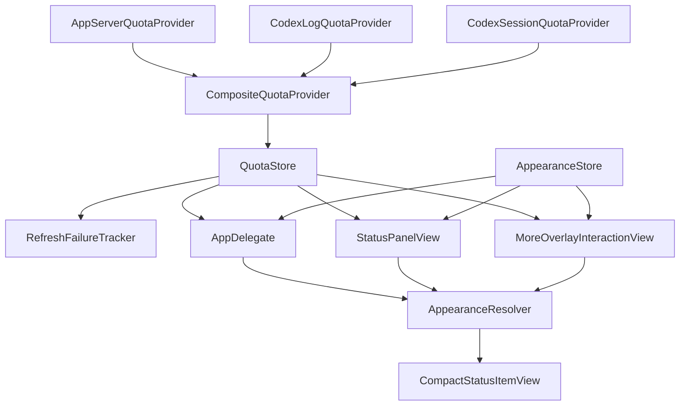

# LOUD README Visual Refresh Design

- **Date:** 2026-07-18
- **Status:** Approved for implementation planning
- **Scope:** README information architecture, deterministic documentation
  renders, and documentation validation

## 1. Objective

Refresh the remaining README visuals and reorganize the README so it first
explains the product's quota and refresh behavior, then presents the appearance
system.

The update must:

- replace the old blue-white quota and refresh diagrams with LOUD examples;
- preserve the three-theme overview as the opening product visual;
- document every user-adjustable appearance category;
- show the complete appearance editor through a 2×2 LOUD production-view
  atlas;
- keep every visual and claim traceable to current production source code;
- remain deterministic, local-only, and free of real user data.

## 2. Non-goals

This work does not:

- add a new quota state, refresh state, theme, setting, or runtime behavior;
- change quota thresholds or retry timing;
- change production layout for documentation aesthetics;
- introduce Photoshop, image-generation, or hand-drawn approximations of
  application UI;
- read real quota values, preferences, authentication data, session content,
  or user paths;
- publish a release or change installation behavior.

## 3. Approved Visual Direction

### 3.1 Status figures

Both status figures use a compact LOUD matrix:

- real menu-bar status items are the visual focus;
- labels and explanations sit outside the status item;
- a status label never replaces the menu-bar quota text;
- hard outlines, LOUD yellow, coral, teal, and hard shadows provide the
  surrounding documentation composition.

The confirmed-failure example continues to display the latest quota text. Only
the status-item background changes to the existing white-and-red failure
pattern.

### 3.2 Appearance editor figure

The LOUD appearance example becomes one 2×2 atlas:

1. theme selection and base palette;
2. panel typography, geometry, shadow, and material;
3. status-item display-layer controls;
4. advanced state colors.

The main appearance page needs two scroll positions to cover its existing
controls. The other two cells render the existing status-item and state-color
pages.

The atlas may add section labels outside the production views. It may not add,
remove, restyle, or reposition controls inside the production views.

## 4. Source-of-truth Contract

README screenshots and diagrams are source-backed documentation artifacts.

### 4.1 Menu-bar rendering

Quota and refresh figures must render the production
`CompactStatusItemView`. The renderer supplies only:

- a fixed `QuotaSnapshot`;
- an existing `AppearanceProfile.default(for: .loud)`;
- an existing `RefreshHealth`;
- the `ResolvedStatusItemAppearance` returned by `AppearanceResolver.status`;
- a fixed status-bar thickness for deterministic layout.

The production view remains responsible for:

- combining `menuBarTitle` and `menuBarTrailingTitle`;
- font selection and tracking;
- intrinsic width calculation;
- outline, corner radius, shadow, padding, and height;
- primary and weekly text colors;
- the confirmed-failure stripe pattern.

The documentation renderer must not duplicate these rules.

Labels may explain each resolved state outside the production status item.
They must not add unlabeled marks that could be mistaken for part of the
application's menu-bar UI.

### 4.2 Appearance-editor rendering

The settings atlas renders the existing:

- `AppearanceEditorView`;
- `StatusItemEditorView`;
- `StateColorsEditorView`;
- `MoreOverlayDecorationView`;
- `MoreOverlayInteractionView`.

Documentation-only seams may select a page and initial scroll target. Their
default values must preserve normal application behavior.

The state-color target must expose all five existing rows: normal, warning,
danger, unavailable base, and unavailable stripe.

### 4.3 Logic ownership

The following production types remain authoritative:

- `QuotaSnapshot` for menu-bar text and dual/weekly layout;
- `AppearanceResolver` for semantic colors and resolved geometry;
- `RefreshHealth.showsFailurePattern` for stripe visibility;
- `RefreshFailureTracker` for retry and confirmation timing;
- `AppearanceStore` and the editor views for editable fields and persistence.

If an intended visual cannot be generated by these source paths, rendering
stops until a minimal read-only seam is available. The documentation layer must
not invent a replacement.

## 5. Fixed Demonstration Data

All fixtures are synthetic and constant.

### 5.1 Quota state figure

The LOUD quota figure contains three dual-window snapshots:

| State | Menu-bar text | Remaining quota |
|---|---|---|
| Normal | `74% | 3h29m | 82%` | 74% |
| Warning | `39% | 1h42m | 74%` | 39% |
| Danger | `12% | 35m | 61%` | 12% |

The colors come from `AppearanceResolver`. The thresholds remain:

- danger: 0%–20%;
- warning: 21%–45%;
- normal: 46%–100%.

### 5.2 Refresh health figure

The figure contains both supported display modes.

Dual-window text:

```text
61% | 3h8m | 74%
```

Weekly-only text:

```text
5d22h | 69%
```

Each row contains:

1. `.live`;
2. `.confirmingFailure`;
3. confirmed failure using `.degraded` with a recent snapshot.

The first two cells keep the same solid quota appearance. The third keeps the
same quota text and enables the production failure pattern.

Labels outside the status item explain:

- live values come from a successful real-time read;
- confirmation retries occur after 15 and 45 seconds;
- confirmation requires three failures and at least 60 elapsed seconds;
- the first confirmed retry waits 2 minutes;
- sustained failures cap subsequent retries at 5 minutes.

## 6. Asset Set

| Asset | Pixel size | Purpose |
|---|---:|---|
| `panel-preview.png` | 2400×900 | Existing LOUD/BOLD/FROST overview; unchanged |
| `quota-states-loud.png` | 1840×720 | LOUD normal/warning/danger status items |
| `refresh-states-loud.png` | 1840×1350 | LOUD live/confirming/confirmed states in both layouts |
| `appearance-settings-loud.png` | 1440×2400 | LOUD 2×2 complete editor atlas |

All generated PNGs use:

- 2× raster scale;
- 144 DPI metadata;
- sRGB;
- Aqua/light appearance;
- deterministic fixed content;
- at most 3 MiB per file;
- at most 5 MiB combined across the four README PNGs.

After README references move to the new PNG files, remove:

- `docs/images/quota-states.svg`;
- `docs/images/refresh-states.svg`.

## 7. README Information Architecture

The README becomes a product-first landing page.

### 7.1 Overview

- one-sentence native macOS menu-bar positioning;
- local quota monitoring and customizable appearance;
- existing LOUD/BOLD/FROST status-item and panel overview.

### 7.2 Core Features

#### Menu Bar Quota Monitoring

Explain:

- 5-hour remaining quota;
- reset countdown;
- weekly quota;
- automatic weekly-only layout.

#### Quota State Visualization

Display `quota-states-loud.png`.

Explain that users may customize colors while the state thresholds remain
fixed. Keep exact numeric ranges inside a `<details>` block.

#### Refresh Health Monitoring

Display `refresh-states-loud.png`.

Explain that quota state and data freshness are separate:

- a temporary failure retains the latest reliable quota and solid status
  appearance;
- confirmed failure retains the quota text and enables the stripe pattern;
- when a reliable snapshot exists, failure indication never replaces quota
  information; the genuine no-snapshot unavailable state still displays
  `未同步`.

#### Feature Summary

Retain and consolidate real capabilities:

- five-hour plus weekly and weekly-only layouts;
- automatic and manual refresh;
- local fallback;
- notifications and optional voice broadcast;
- per-theme appearance;
- native color panel;
- no telemetry or uploaded session content.

### 7.3 Appearance System

#### Theme Presets

Explain that LOUD, BOLD, and FROST independently persist colors, panel
geometry, and status-item geometry.

#### Appearance Editor

Display `appearance-settings-loud.png`.

Use reader-facing groups rather than an uninterrupted parameter list:

- panel;
- status item;
- state colors;
- editor typography.

Place exact fields and ranges inside a `<details>` block.

#### Native Color Customization

Document only existing behavior:

- preset swatches;
- native macOS color panel;
- alpha support;
- live preview;
- per-theme persistence.

### 7.4 Architecture

Use a small Mermaid diagram whose node names match source types:



Supporting prose explains that quota acquisition, refresh reliability, and
appearance resolution are separate responsibilities.

### 7.5 Remaining sections

Preserve and reorder useful existing content:

1. Privacy
2. Installation
3. Data Sources and Fallback
4. Development and Project Structure
5. System Requirements and FAQ
6. License, Attribution, and Disclaimer

## 8. Complete Appearance Parameter Inventory

The README's collapsed parameter reference is generated from current editor
fields:

| Scope | Fields |
|---|---|
| Theme | LOUD, BOLD, FROST; independently persisted |
| Base palette | background, surface, text and outline, action accent |
| Panel typography and geometry | font scale 80%–125%, outline 0–4 pt, corner radius 0–28 pt |
| Editor typography | global editor scale 90%–150% |
| Panel shadow and material | shadow depth 0–10 pt, blur 0–20 pt, surface opacity 55%–100% |
| Status item | font 8–14 pt, outline 0–4 pt, radius 0–12 pt, shadow depth 0–6 pt, blur 0–8 pt, horizontal padding 2–14 pt, height 14–22 pt |
| State colors | normal, warning, danger, unavailable base, unavailable stripe |
| Reset | reset the selected theme only |

The README does not expose compatibility-only ranges that are not available in
the editor.

## 9. Renderer and Installation Flow

`DocumentationPreviewRenderer.renderAll` produces every required PNG in one
isolated output directory.

`scripts/render-doc-previews.sh` retains its transactional behavior:

1. create a system-temporary staging directory;
2. render all assets with isolated in-memory preferences;
3. validate the complete staged set;
4. acquire the documentation-image install lock;
5. create rollback copies for every existing target;
6. install all new files atomically within the repository filesystem;
7. validate installed files and compare them with staging;
8. restore the complete previous set if any replacement or validation fails;
9. remove staging, temporary, lock, and rollback files.

Partial asset installation is not an acceptable result.

## 10. Validation

### 10.1 Renderer tests

Tests must prove:

- fixed snapshots produce expected menu-bar text;
- dual-window and weekly-only production status views render;
- changing injected text changes pixels;
- normal, warning, and danger fixtures change the resolved production
  appearance;
- `.confirmingFailure` does not enable the failure pattern;
- confirmed failure preserves menu-bar text and changes pixels through the
  production stripe path;
- each settings cell consumes the requested production page and scroll target;
- two renders in separate processes are byte-identical;
- rendering leaves no preferences or temporary artifacts.

### 10.2 Asset validator

The validator checks:

- exact required filenames;
- PNG type;
- exact dimensions;
- sRGB;
- 144±0.5 DPI;
- per-file and combined size budgets;
- exact README references;
- absence of obsolete SVG references;
- existence of retained legacy explanatory assets only when still referenced.

### 10.3 Regression validation

Run:

```sh
bash -n scripts/*.sh
scripts/validate-doc-images.sh
git diff --check
scripts/test.sh
scripts/test-install.sh
```

Complete final visual inspection at native resolution and at the README display
width.

## 11. Acceptance Criteria

The design is complete when:

- the README follows the approved product-first order;
- quota and refresh figures visibly use the LOUD production menu-bar view;
- all status examples preserve real quota text;
- confirmed failure uses the production white-and-red stripe path;
- the appearance atlas covers all four approved editor categories;
- every documented field and range matches current editor source;
- no documentation-only behavior is presented as application behavior;
- old SVGs are no longer referenced or tracked;
- deterministic render, validation, regression, installation, and visual checks
  all pass.
